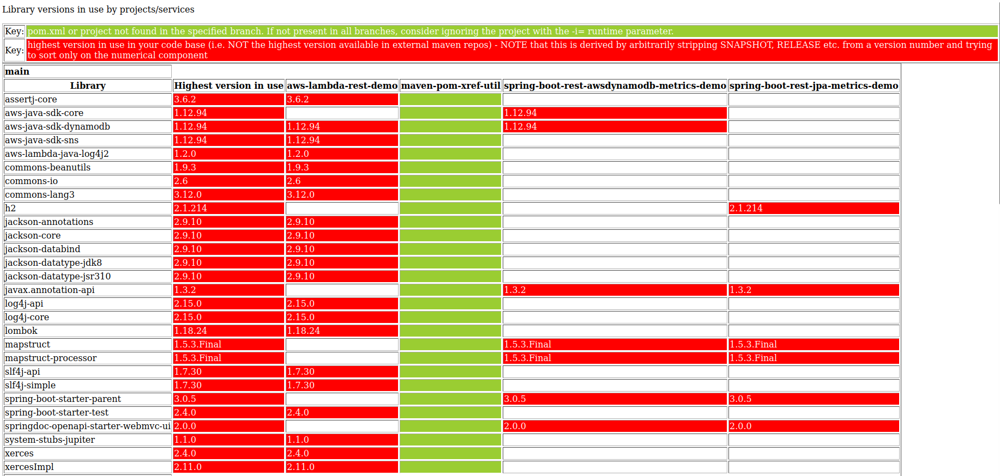

# Maven cross-reference utils
## pom-xref-file-system.py
## pom-xref-github.py

A simple python utility (Disclaimer: I'm a Java with maven developer not a Python developer) to read 
* GitHub repos for all MAVEN projects with a given prefix 
OR
* A nominated local directory containing maven based projects and 
  - get the relevant pom.xml for repo/branch
  - cross-reference all library dependencies ...
  - produce in the 'results' sub-directory (which you may have to create)
    - an html xref of all selected repos to show which version of which library is used in which project

# to run
NOTE that the entry point to run these utilities are python scripts, which then reference modules within a package, so 
to run the utilities correctly, please change to the correct directory ('maven-pom-xref-util/src') first so that python can then resolve the 
package modules correctly.

## option 1 - GitHub
### dependencies
```commandline
import argparse
import base64
import datetime
import json
import os
import tempfile
from io import StringIO
import requests
import xmltodict
```
### GitHub security
The script expects to be supplied with a git username and a git PAT 'personal access token' which has access to all relevant repositories to be queried.
See Github https://github.com/settings/tokens

### command line parameters
if not already positioned in the 'maven-pom-xref-util/src' , change directory now i.e. on linux, inside the maven-pom-xref-util downloaded directory
```commandline
cd src
```
then, execute the relevant python module (using -m) and specifying the relevant parameters:
```
python3 -m pom_xref_util.pom-xref-github -u=<git username> -t=<github PAT> -p=<repo prefix to select, empty for all> -b=<comma separated list of branches to include> -ia=<ignore archived projects Y|N> -ip=<ignore private projects Y|N>  -i=<comma-separated list of repositories to IGNORE - no spaces between the repo names, just a comma>
```
for more parameter information (also inside the src directory):
```
python3 -m pom_xref_util.pom-xref-github --help
```

## option 2 - File System
### dependencies
```commandline
import argparse
import datetime
import os
import xmltodict
from io import StringIO
```
### Requirements
The script expects to be supplied with a local directory name containing all relevant repositories to be queried.

It will process only the top level projects within that directory, e.g.
```commandline
source-directory
->  maven-project-one
    .....
    pom.xml
->  maven-project-two
    .....
    pom.xml
```

### command line parameters
if not already positioned in the 'maven-pom-xref-util/src' , change directory now i.e. on linux, inside the maven-pom-xref-util downloaded directory
```commandline
cd src
```
python3 -m pom_xref_util.pom-xref-file-system.py -d=/home/maven-projects/source-directory -p=<repo prefix to select, empty for all> -i=<comma-separated list of repositories to IGNORE - no spaces between the repo names, just a comma>
```
for more parameter information:
```
python3 -m pom_xref_util.pom-xref-file-system.py --help
```

To build a distribution, see
```commandline
https://packaging.python.org/en/latest/tutorials/packaging-projects/
```
## Example HTML output
